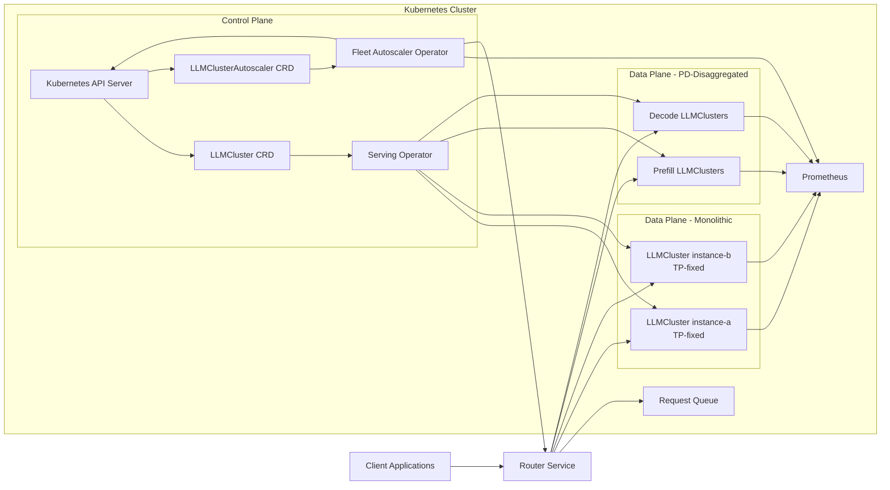
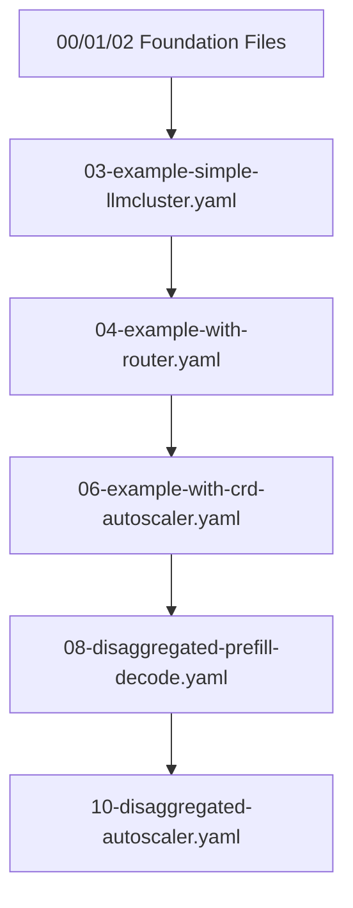

# Architecture Diagrams (Mermaid)

## High-level system architecture overview

```mermaid
graph LR
    Client[Client Applications] --> Router[Router Service]

    subgraph K8s[Kubernetes Cluster]
        subgraph CP[Control Plane]
            API[Kubernetes API Server]
            CRD1[LLMCluster CRD]
            CRD2[LLMClusterAutoscaler CRD]
            Op1[Serving Operator]
            Op2[Fleet Autoscaler Operator]
        end

        subgraph DP1[Data Plane - Monolithic]
            MonoA[LLMCluster instance-a\nTP-fixed]
            MonoB[LLMCluster instance-b\nTP-fixed]
        end

        subgraph DP2[Data Plane - PD-Disaggregated]
            Prefill[Prefill LLMClusters]
            Decode[Decode LLMClusters]
        end

        Queue[Request Queue]
        Prom[Prometheus]
    end

    API --> CRD1
    API --> CRD2
    CRD1 --> Op1
    CRD2 --> Op2

    Op1 --> MonoA
    Op1 --> MonoB
    Op1 --> Prefill
    Op1 --> Decode

    Op2 --> API
    Op2 --> Prom
    Op2 --> Router

    Router --> Queue
    Router --> MonoA
    Router --> MonoB
    Router --> Prefill
    Router --> Decode

    MonoA --> Prom
    MonoB --> Prom
    Prefill --> Prom
    Decode --> Prom
```

## Progressive deployment map

```mermaid
flowchart TD
    F0[00/01/02 Foundation Files] --> M0[03-example-simple-llmcluster.yaml]
    M0 --> M1[04-example-with-router.yaml]
    M1 --> M2[06-example-with-crd-autoscaler.yaml]
    M2 --> D0[08-disaggregated-prefill-decode.yaml]
    D0 --> D1[10-disaggregated-autoscaler.yaml]
```
