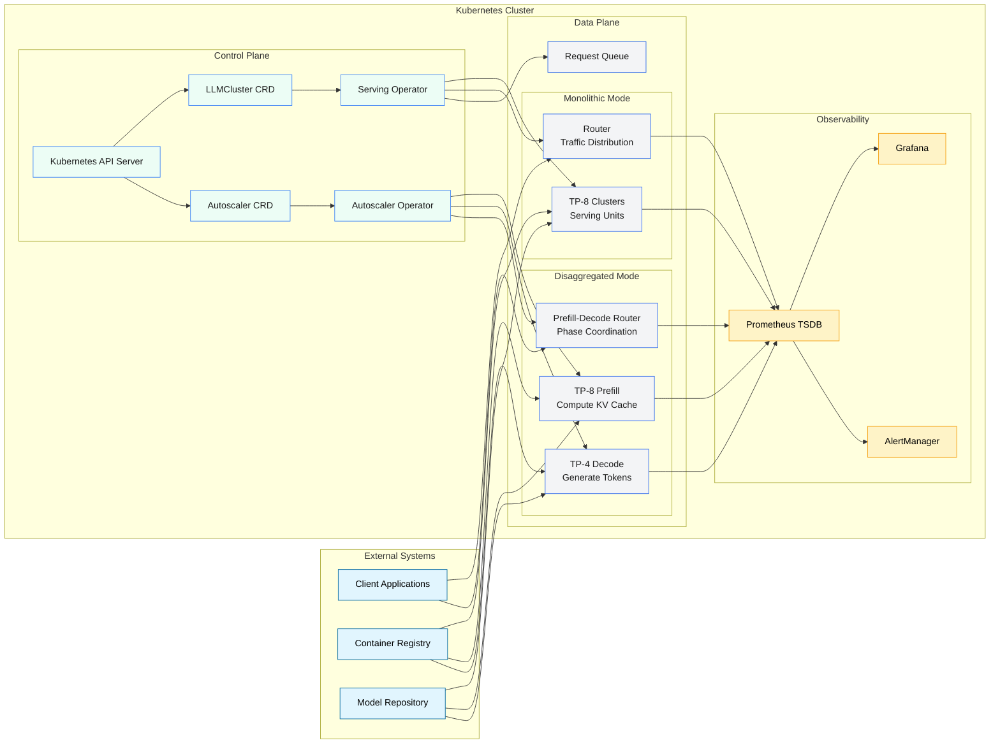
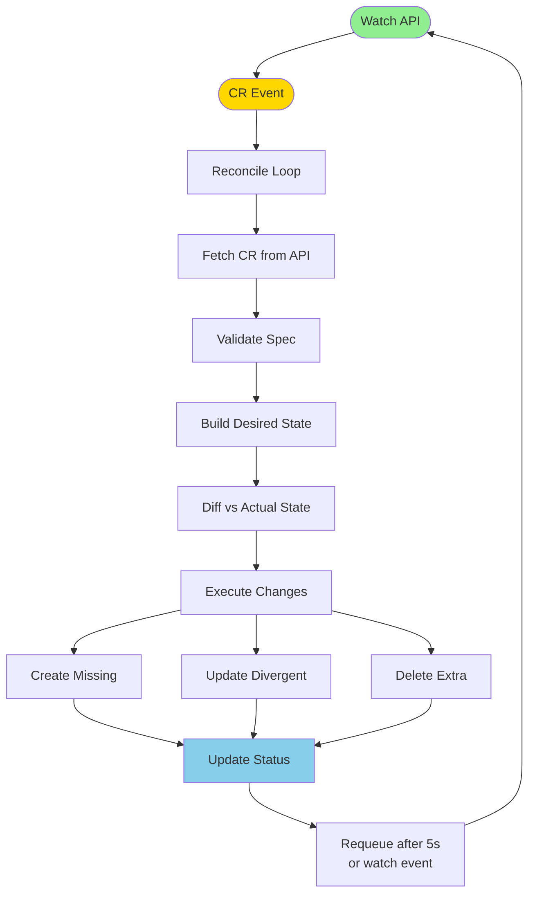
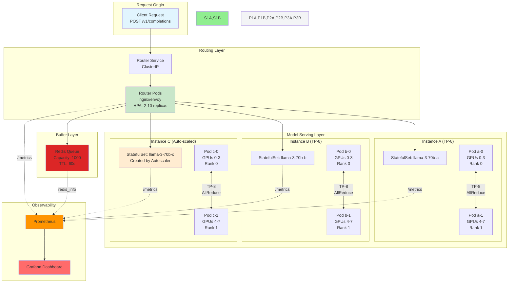
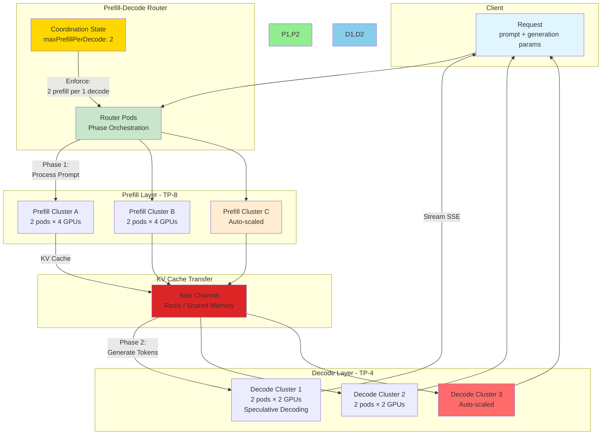
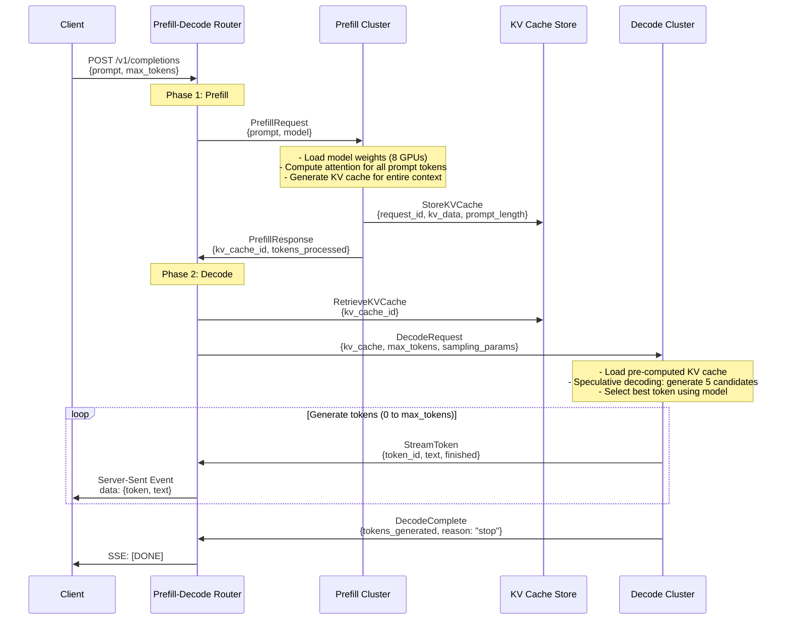
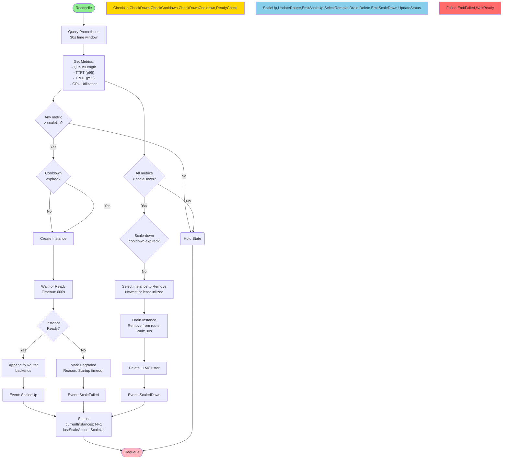
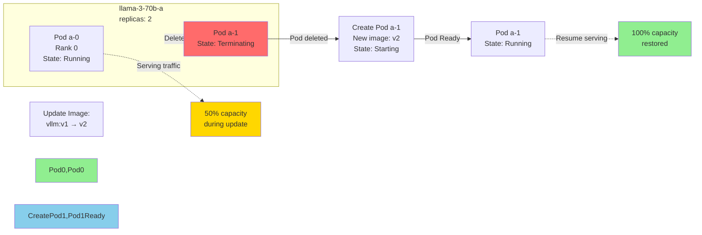
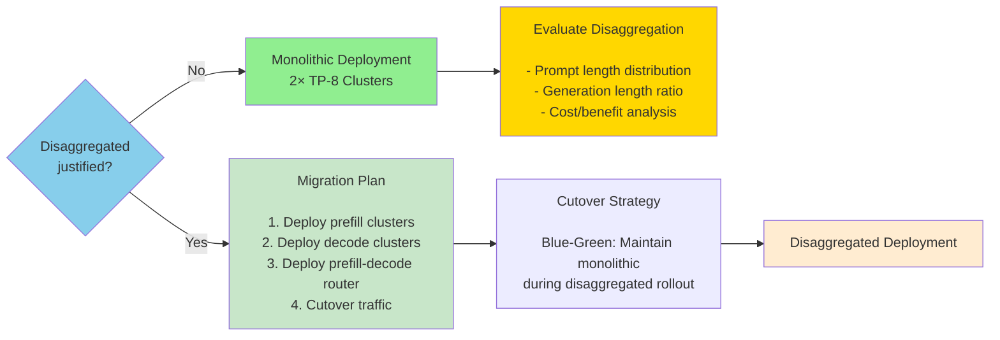

# LLM Serving on Kubernetes: Production Architecture

## Abstract

This document describes the production architecture for serving Large Language Models (LLMs) on Kubernetes using custom CRDs (Custom Resource Definitions). The system supports two serving modalities:

1. **Monolithic Serving**: Traditional single-cluster serving with router-based load balancing
2. **Disaggregated Prefill/Decode Serving**: Two-phase serving with independent prefill and decode clusters

Both modalities share a common control plane and observability stack while optimizing for different workload characteristics.

---

## Table of Contents

1. [Design Principles](#design-principles)
2. [Architecture Overview](#architecture-overview)
3. [Control Plane](#control-plane)
4. [Data Plane - Monolithic](#data-plane-monolithic)
5. [Data Plane - Disaggregated](#data-plane-disaggregated)
6. [Scaling Strategy](#scaling-strategy)
7. [Fault Tolerance and High Availability](#fault-tolerance-and-high-availability)
8. [Observability](#observability)
9. [Operational Considerations](#operational-considerations)
10. [Performance Characteristics](#performance-characteristics)
11. [Deployment Patterns](#deployment-patterns)

---

## Design Principles

### 1. Fixed-Shape Tensor Parallelism

**Core Constraint**: Tensor parallelism requires a fixed number of GPUs per model instance.

```
tensorParallelSize = replicas × gpusPerPod
```

For Llama-3-70B (TP-8):
- 2 pods × 4 GPUs/pod = 8 GPUs working as one distributed unit
- All pods must be present for the model to function
- Adding a 3rd pod breaks the TP configuration

**Architectural Implication**: Horizontal scaling = creating whole new instances, not adding pods to existing instances.

### 2. Control/Data Plane Separation

The system separates concerns into two logical planes:

| Plane | Responsibility | Components |
|--------|---------------|-------------|
| **Control Plane** | Orchestration, reconciliation, scaling decisions | CRDs, Operators, Controllers |
| **Data Plane** | Request processing, model inference | StatefulSets, Services, Router |

This separation enables:
- Independent evolution of control logic (operators) and serving stack (model images)
- Clear RBAC boundaries (control plane admins vs data plane operators)
- Isolated failure domains (controller crash doesn't affect serving traffic)

### 3. Declarative Infrastructure

All resources are defined declaratively through CRDs:
- **LLMCluster**: Defines model serving topology (TP size, replicas, image)
- **LLMClusterAutoscaler**: Defines scaling policies (metrics, thresholds, templates)

Operators reconcile desired vs actual state continuously, providing self-healing without human intervention.

---

## Architecture Overview

### System Context Diagram



### Component Matrix

| Component | Type | Owner | Mode | Scaling Mechanism |
|-----------|------|--------|------------------|
| **LLMCluster CRD** | Control Plane | All | Declarative (user creates instances) |
| **Autoscaler CRD** | Control Plane | All | Declarative (user defines policies) |
| **Serving Operator** | Controller | All | Reconciles LLMCluster resources |
| **Autoscaler Operator** | Controller | All | Monitors metrics, creates/deletes LLMClusters |
| **Router Deployment** | Data Plane | Monolithic, Disaggregated | HPA (Kubernetes native) |
| **Model StatefulSet** | Data Plane | All | Fleet scaling (create/delete instances) |
| **Prefill Clusters** | Data Plane | Disaggregated | Independent scaling (2-6 instances) |
| **Decode Clusters** | Data Plane | Disaggregated | Independent scaling (4-12 instances) |

---

## Control Plane

### CRD Architecture

#### LLMCluster CRD

Defines the schema for model serving instances. Key design decisions:

**Validation**: CRD-level validation ensures `tensorParallelSize = replicas × gpusPerPod` before resources are created.

**Status Subresource**: Separated from spec to prevent user modification of operator-owned fields.

**Conditions**: Rich status communication through typed conditions (Ready, Progressing, Degraded).

#### LLMClusterAutoscaler CRD

Supports both monolithic and disaggregated modes via `spec.mode` field:

| Mode | Topology | Scale Targets |
|------|-----------|---------------|
| **monolithic** | Single fleet of identical TP clusters | All LLMClusters matching `scaleTargetRef.labelSelector` |
| **disaggregated** | Separate prefill and decode fleets | Prefill: clusters with `role=prefill`<br/>Decode: clusters with `role=decode` |

**Rationale for Single CRD**:
- Shared autoscaling logic (stabilization, cooldown, decision engine)
- Unified status reporting format
- Single RBAC role for all autoscaling operations

### Operator Reconciliation

Both operators follow the Kubernetes controller pattern:



**Reconciliation Frequency**: Event-driven with periodic full-resync every 30s (defensive against missed events).

**Conflict Resolution**: Last write wins. Operator restarts recover by re-applying desired state from CR specs.

---

## Data Plane - Monolithic

### Architecture



### Request Flow

1. **Ingress**: Client request hits router LoadBalancer service
2. **Queue Check**: Router checks Redis for pending request count
3. **Routing Decision**:
   - If queue depth < threshold: Route directly to least-loaded backend
   - If queue depth ≥ threshold: Enqueue in Redis, return 202 Accepted
4. **Model Selection**: Router chooses backend based on:
   - Active connections per backend
   - Backend health (readiness probes)
   - Round-robin within health tier
5. **Request Processing**: Selected backend processes request and streams response
6. **Metrics Collection**: All components expose `/metrics` endpoint scraped by Prometheus

### Router Backend Management

The router maintains dynamic backend lists via configuration updates from the autoscaler:

**Scale-Up Event**:
```
1. Autoscaler creates LLMCluster instance-c
2. Wait for instance-c StatefulSet to become Ready
3. Autoscaler patches router.spec.router.backends:
   - Append: {name: "instance-c", service: "llama-3-70b-c", weight: 100}
4. Router pods receive ConfigMap update and reload configuration
5. New backend starts receiving traffic
```

**Scale-Down Event**:
```
1. Autoscaler patches router.spec.router.backends (remove instance-b)
2. Router removes backend from rotation immediately
3. Router allows in-flight requests to drain (30s grace period)
4. Kubernetes terminates StatefulSet pods after connections drain
```

---

## Data Plane - Disaggregated

### Architecture

Disaggregated serving separates the two compute phases of LLM inference:

| Phase | Function | TP Size | Hardware Profile |
|--------|-----------|----------|------------------|
| **Prefill** | Process entire prompt, compute attention matrices, generate KV cache | TP-8 | High compute, high memory bandwidth |
| **Decode** | Generate tokens incrementally using pre-computed KV cache | TP-4 | High memory capacity, speculative decoding |



### Two-Phase Request Flow

#### Sequence Diagram



### Coordination Constraints

The router enforces phase coordination to prevent resource exhaustion:

| Constraint | Value | Rationale |
|-----------|-------|-----------|
| **maxPrefillPerDecode** | 2 | Prevents decode cluster starvation (prefill produces faster than decode can consume) |
| **decodeQueueing** | enabled, maxSize: 100 | Batches decode requests when prefills are backlogged |
| **kvCacheTransferTimeout** | 5s | Fails fast if KV cache transfer exceeds threshold |

**Coordination Logic**:
```python
# Pseudocode from router
active_decodes = count(decode_clusters_ready)
max_prefill = active_decodes * maxPrefillPerDecode

if available_prefills < max_prefill:
    admit_prefill_request()
else:
    queue_for_decode_slot()
    reject_prefill_request(503, "decode capacity saturated")
```

---

## Scaling Strategy

### Why Not StatefulSet HPA?

Standard Kubernetes HPA (Horizontal Pod Autoscaler) scales `replicas` on Deployments and StatefulSets.

**For LLM serving with Tensor Parallelism, this is invalid**:

```
Wrong: HPA mutates StatefulSet.spec.replicas
┌─────────────────────────────────────────────────────┐
│ StatefulSet: llama-3-70b-a                │
│   replicas: 2 → 4 (HPA scale-up)      │
│                                              │
│   TP-8 model expects 2 pods               │
│                                              │
│   Pods 2,3: No rank assignment            │
│   Distributed init hangs                    │
│   Model serving FAILS                       │
└─────────────────────────────────────────────────────┘

Correct: Fleet scaling creates whole new instances
┌─────────────────────────────────────────────────────┐
│ Instance A: 2 pods, TP=8 (running)        │
│ Instance B: 2 pods, TP=8 (running)        │
│ Instance C: 2 pods, TP=8 (NEW - created by  │
│            autoscaler for capacity)              │
│                                              │
│ Each instance: Correct TP configuration         │
│ Router balances across A, B, C                │
│ Model serving WORKS                       │
└─────────────────────────────────────────────────────┘
```

### Fleet Autoscaling

**Decision Engine**: Multi-metric evaluation with hysteresis.



**Hysteresis Design**:
```
scaleUp_threshold > scaleDown_threshold

Example for QueueLength:
- Scale up when: queue > 100
- Scale down when: queue < 20
- Prevents oscillation around single threshold
```

**Stabilization Windows**:
- Scale-up: 120s (prevent rapid scale-up)
- Scale-down: 600s (conservative, ensure sustained low load)

---

## Fault Tolerance and High Availability

### Pod Disruption Budget

Each LLMCluster has a PodDisruptionBudget (PDB):

```yaml
podDisruptionBudget:
  enabled: true
  minAvailable: 1
```

**Protection During**:
- Voluntary disruptions: Node drain, cluster upgrade
- Involuntary disruptions: Node failure, zone outage

**Impact**: At least 1 pod (50% of TP group) remains available during disruption.

### Rolling Update Strategy

StatefulSets use `OnDelete` update strategy:



**Capacity During Update**: 50% (one TP pod remains available).

### Failure Domains

| Component | Failure Mode | Detection | Recovery |
|-----------|--------------|------------|------------|
| **Model Pod** | OOMKilled, CrashLoopBackOff | Readiness probe fails → StatefulSet recreates pod |
| **Router Pod** | Unresponsive | Readiness probe fails → Deployment recreates pod |
| **Prefill Cluster** | All pods not ready | Router removes from prefill backends |
| **Decode Cluster** | High latency | Autoscaler scales out more decode clusters |
| **Autoscaler** | Crash on reconcile | Kubernetes restarts deployment, resumes from last state |

---

## Observability

### Metrics Taxonomy

| Category | Metrics | Source | Use Case |
|----------|---------|--------|-----------|
| **Request** | queue_length, request_rate, error_rate | Autoscaling decisions |
| **Latency** | ttft_p95, tpot_p95, total_latency | SLO compliance, troubleshooting |
| **Throughput** | tokens_per_second, requests_per_second | Capacity planning |
| **Resource** | gpu_utilization, gpu_memory_used, cpu_percent | Right-sizing, cost optimization |
| **Prefill-Specific** | prefill_latency, prefill_queue_depth, kv_transfer_time | Disaggregated mode tuning |
| **Decode-Specific** | decode_latency, speculative_accuracy, decode_tps | Disaggregated mode tuning |

### Prometheus Integration

**Scrape Configuration**:
```yaml
serviceMonitors:
  - name: llmcluster-models
    selector:
      matchLabels:
        app: llama-3-70b
    endpoints:
    - port: 9090
      path: /metrics
      interval: 15s
```

**Key PromQL Queries**:
```promql
# Queue depth (autoscale trigger)
sum(redis_queue_length{queue="request_queue",app="llama-3-70b"})

# Time to first token (user-facing SLO)
histogram_quantile(0.95,
  sum(rate(llm_ttft_seconds_bucket{app="llama-3-70b"}[2m])) by (le)
) * 1000

# Time per output token (generation quality)
histogram_quantile(0.95,
  sum(rate(llm_tpot_seconds_bucket{app="llama-3-70b"}[2m])) by (le)
) * 1000

# GPU utilization (cost optimization)
DCGM_ForceUtilization{gpu="0",app="llama-3-70b"}
```

### Alerting Rules

| Alert | Severity | Condition | Action |
|--------|----------|-----------|--------|
| **HighQueueDepth** | Warning | queue_length > 50 | Page on-call, check for bottleneck |
| **TTFTBreach** | Critical | ttft_p95 > 3000ms | Scale-up evaluation, check model loading |
| **TPOTBreach** | Critical | tpot_p95 > 200ms | Scale-up evaluation, check decode capacity |
| **HighGPUUtil** | Info | gpu_util > 95% | Consider right-sizing, check for waste |
| **ScaleOscillation** | Warning | Scale frequency > 1 per 5min | Adjust stabilization windows |

### Grafana Dashboards

Recommended dashboards:

1. **System Overview**: Cluster health, request rate, error rate
2. **Autoscaler**: Current/desired instances, last scale action, metric trends
3. **Performance**: TTFT, TPOT histograms, throughput over time
4. **Resource**: GPU utilization, memory usage, pod counts
5. **Disaggregated** (if applicable): Prefill/decode latency, KV cache transfer time

---

## Operational Considerations

### Resource Right-Sizing

**Model Loading Time**: Proportional to model size and TP degree.

| Model | TP Size | Load Time | GPU Memory |
|--------|---------|------------|--------------|
| Llama-3-8B | TP-4 | ~10s | 16GB |
| Llama-3-70B | TP-8 | ~45s | 80GB |

**Implication**: Scale-up latency must account for model loading (default 600s timeout).

### Cost Optimization

**GPU Allocation Strategy**:

| Approach | Description | Trade-off |
|-----------|-------------|--------------|
| **Dedicated per instance** | Each instance has exclusive GPUs | Predictable performance, higher cost |
| **Shared GPU (MIG)** | Multiple instances per GPU (A100/H100) | Lower cost, performance isolation complexity |
| **Spot preemption** | Use spot GPU instances | 50-80% cost savings, risk of interruption |

**Recommendation**: Start with dedicated, evaluate MIG for inference workloads with stable low-batch inference.

### Capacity Planning

**Theoretical Throughput Calculation**:

```
tokens_per_second = (decode_clusters) × (tokens_per_decode_batch)

Example:
- 8 decode clusters
- 100 tokens/second per cluster (speculative decoding, batch=4)
- Total: 800 tokens/second = 48K tokens/minute
```

**Real-World Factors**:
- Network overhead (-5%)
- KV cache transfer latency (-2% per hop)
- Queue contention (-3% at 80% capacity)
- **Efficiency**: ~85% of theoretical

### Cluster Sizing

| Instance Type | Min | Max | Use Case |
|--------------|-----|------|----------|
| **Prefill Cluster** | 2 | 6 | High prompt load, long contexts |
| **Decode Cluster** | 4 | 12 | High token generation rate |
| **Monolithic** | 2 | 10 | Balanced workload, simple ops |

---

## Performance Characteristics

### Latency Budget Breakdown

For monolithic serving (TTFT + TPOT = Total):

| Component | Target | Contribution |
|-----------|--------|--------------|
| **Queue Wait** | < 50ms | 5% |
| **Router Forward** | < 20ms | 2% |
| **Network to Pod** | < 10ms | 1% |
| **Model Loading** | < 100ms (cached) | 10% |
| **Prefill (TTFT)** | < 2000ms | 75% |
| **Per-Output Token (TPOT)** | < 100ms | 10% |
| **Return Path** | < 20ms | 2% |
| **Total p95** | < 2500ms | 100% |

For disaggregated serving:
- **Prefill TTFT**: < 2500ms (dominates total time)
- **KV Transfer**: < 100ms
- **Decode TPOT**: < 100ms (same as monolithic)
- **Total**: Similar to monolithic for long generations, **better for short generations**

### When to Use Disaggregated Serving

| Scenario | Recommended Mode | Rationale |
|----------|------------------|-----------|
| **Short prompts, long generation** | Monolithic | Prefill cost amortized over many tokens |
| **Long prompts, short generation** | Disaggregated | Prefill isolated, decode optimized for generation |
| **High variation in prompt length** | Disaggregated | Prefill clusters scale independently |
| **Bursty decode traffic** | Disaggregated | Decode clusters scale independently |
| **Simple ops, stable workload** | Monolithic | Fewer moving parts |
| **Cost optimization focus** | Disaggregated | Right-size prefill (TP-8) vs decode (TP-4) |

### Speculative Decoding

Available in disaggregated decode clusters:

```yaml
inferenceArgs:
  speculativeDecoding:
    enabled: true
    numSpeculativeTokens: 5
    samplingStrategy: multinomial  # or "beam", "greedy"
```

**Performance Impact**:
- Throughput gain: 1.5-2.5× (token generation speed)
- Memory overhead: +15% GPU memory per decode cluster
- Quality impact: < 1% degradation vs greedy sampling

---

## Deployment Patterns

### Pattern 1: Development

**Files**: `03-example-simple-llmcluster.yaml`

**Characteristics**:
- Single LLMCluster, TP-8
- No router (direct pod access via Headless service)
- No autoscaling
- Manual capacity management

**Use Case**: Local development, model experimentation, CI/CD pipelines.

### Pattern 2: Production Monolithic

**Files**: `04-example-with-router.yaml` + `06-example-with-crd-autoscaler.yaml`

**Characteristics**:
- 2-10 LLMCluster instances behind router
- Redis queue for request buffering
- Router HPA for front-door scaling
- Fleet autoscaler for backend scaling
- Prometheus + Grafana monitoring

**Use Case**: Production serving with moderate workload variation, simple operations.

### Pattern 3: Production Disaggregated

**Files**: `08-disaggregated-prefill-decode.yaml` + `10-disaggregated-autoscaler.yaml`

**Characteristics**:
- 2-6 prefill clusters (TP-8)
- 4-12 decode clusters (TP-4)
- Prefill-decode router with phase coordination
- Independent autoscaling per phase
- KV cache transfer between phases

**Use Case**: High-throughput production, varied prompt/generation ratios, cost optimization.

### Migration Path

**Monolithic → Disaggregated**:



**Rollback Strategy**: Maintain monolithic deployment until disaggregated validates (latency, error rates, cost).

---

## Appendix: Quick Reference

### YAML File Mapping

| Stage | File | Purpose |
|-------|--------|---------|
| **Foundation** | `00-llmcluster-crd.yaml` | LLMCluster CRD definition |
| | `00-llmclusterautoscaler-crd.yaml` | Autoscaler CRD definition |
| | `01-rbac.yaml` | RBAC for operators |
| | `02-operator-deployment.yaml` | Serving operator deployment |
| | `07-operator-deployment.yaml` | Autoscaler operator deployment |
| **Monolithic** | `03-example-simple-llmcluster.yaml` | Single instance baseline |
| | `04-example-with-router.yaml` | Multi-instance with router |
| | `05-example-with-autoscaling.yaml` | Router HPA example |
| | `06-example-with-crd-autoscaler.yaml` | Monolithic autoscaler policy |
| **Disaggregated** | `08-disaggregated-prefill-decode.yaml` | Prefill/decode clusters |
| | `10-disaggregated-autoscaler.yaml` | Disaggregated autoscaler policy |
| **Architecture** | `11-ARCHITECTURE-DIAGRAMS.md` | Visual Mermaid diagrams |

### kubectl Commands

```bash
# === CRD INSTALLATION ===
kubectl apply -f 00-llmcluster-crd.yaml
kubectl apply -f 00-llmclusterautoscaler-crd.yaml

# === VERIFY ===
kubectl get crd | grep serving.ai

# === OPERATORS ===
kubectl apply -f 02-operator-deployment.yaml
kubectl apply -f 07-operator-deployment.yaml

# === STATUS CHECK ===
kubectl get deployment -l app=llmcluster-operator
kubectl get deployment -l app=llmcluster-autoscaler
kubectl get pods -l app=llmcluster-operator
kubectl get pods -l app=llmcluster-autoscaler

# === INSTANCES ===
kubectl get llmc
kubectl describe llmc <instance-name>

# === AUTOSCALER ===
kubectl get llmca
kubectl describe llmca <autoscaler-name>
kubectl get llmca <name> -o jsonpath='{.status}'

# === LOGS ===
kubectl logs -n <namespace> deployment/llmcluster-operator-xxx
kubectl logs -n <namespace> deployment/llmcluster-autoscaler-xxx

# === EVENTS ===
kubectl get events --sort-by='.lastTimestamp' -A 10
kubectl get events --field-selector involvedObject.kind=LLMCluster
kubectl get events --field-selector involvedObject.kind=LLMClusterAutoscaler
```

---

**Document Version**: 1.0
**Last Updated**: 2024
**Maintainer**: LLM Serving Platform Team
